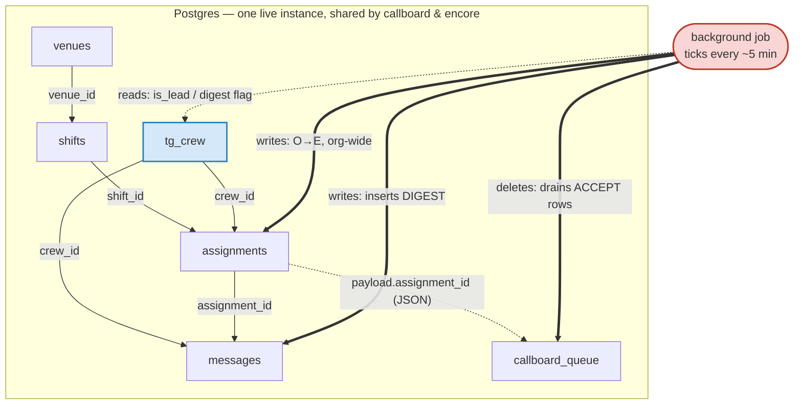
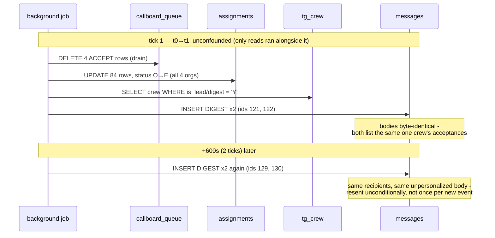
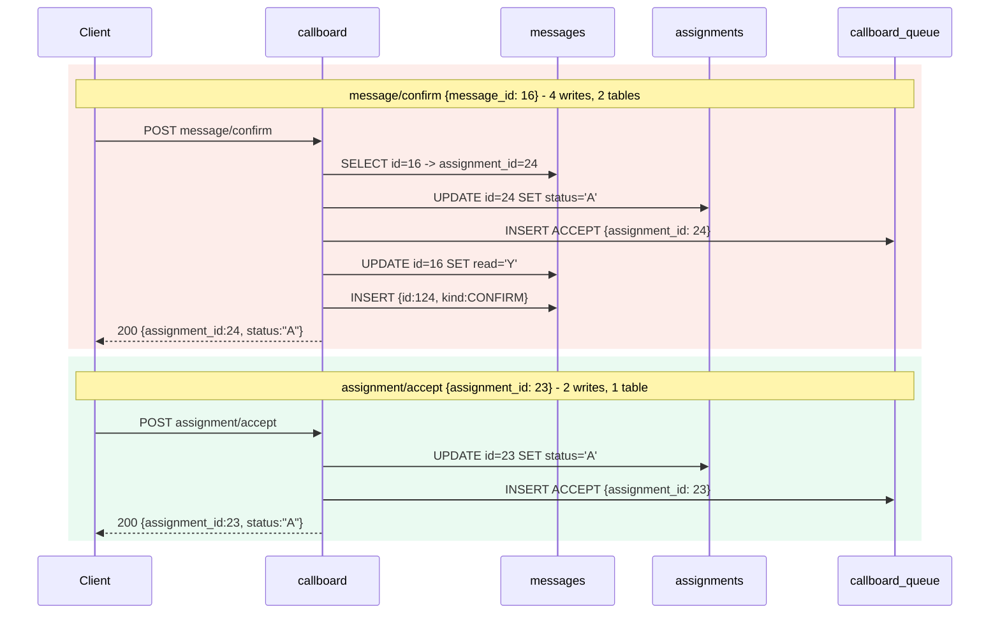
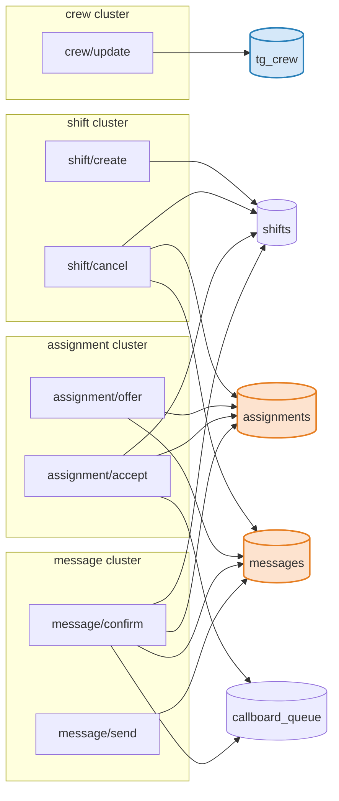
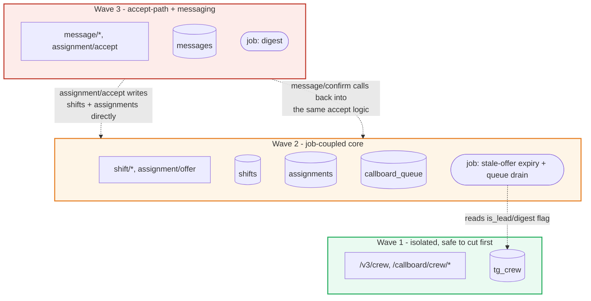

# Phase 1 discoveries

What's actually known about `callboard`'s wire behavior and its background job, from
probing it directly (port 8091) and watching Postgres underneath it — not what the plan
assumed going in. Confidence per finding: **confirmed** (seen directly in a response or a DB
row), **inferred** (consistent with the evidence but not directly isolated), or **open**
(still needs a probe). Feed the confirmed items straight into `SEAMS.md`'s probe-log table.

## Summary

- The background job does two unrelated things per tick: drains `callboard_queue` (purpose
  unknown — no visible effect on the rows it references) and expires stale offers
  (`assignments.status: 'O' → 'E'`) org-wide. It never touches `tg_crew`.
- `message/confirm` and `assignment/accept` share the exact same underlying accept logic —
  confirming a message resolves it to an assignment and runs the identical accept path, plus
  two message-side effects of its own. Messages and assignments cannot be split across waves
  cleanly.
- `shift/cancel` fans out to both `assignments` (a 4th status, `X`) and `messages` (`CXL`) in
  one call; `assignment/offer` writes `messages` too (`CALLOUT`, confirmed by exact id match).
  `assignments → messages` is a one-way street with three distinct paths now traced.
- The background job's digest logic has two real bugs: the message body isn't personalized
  per recipient, and it resends the same digest every tick instead of once.
- Crew's wire shape (envelope, `is_lead`, `prefs_blob`, no `password`) is fully confirmed and
  stable, including the edge cases: `per_page=0` is unpaginated, a nonexistent id returns
  `HTTP 200` with a fail-envelope (not 404), and — confirmed, not leaked — a cross-org id
  returns that identical fail-envelope rather than another org's row.
- The schema has no indexes beyond primary keys, and two of five mutable tables
  (`messages`, `tg_crew`) have no last-modified timestamp at all — real constraints on how
  Phase 1's own tooling, and any future job/audit logic, can scale.

## System overview

Every table reference below (`venue_id`, `shift_id`, `crew_id`, `assignment_id`) is a plain
column, not an enforced foreign key — `\d`/`\di` show no FK constraints anywhere in this
schema, only primary keys. The arrows are confirmed *behavior* (what the app and the job
actually do), not schema-enforced relationships.



Thin arrows = a column referencing another table (not enforced). Thick arrows = the
background job's writes. Dotted arrows = reads only. `tg_crew` (blue) is the one table the
job never writes to — everything else it touches directly.

## Background job

Isolated in a clean run where nothing but read traffic happened between the `t0` and `t1`
snapshots, so every delta below is attributable to the job alone, not a probe call:

| table | before | after | delta | meaning |
| --- | --- | --- | --- | --- |
| `callboard_queue` | 4 live / 0 del | 0 live / 4 del | drains exactly the 4 seeded rows | job drains the queue |
| `assignments` | 0 upd | 84 upd | **+84 updates, 0 inserts** | job expires stale offers, org-wide |
| `messages` | 120 ins | 122 ins | **+2 inserts** | job sends 2 new messages |
| `tg_crew` | 0 upd | 0 upd | **no change** | job never writes to `tg_crew` |
| `shifts` | 60 upd | 60 upd | **no change** | expiring an offer doesn't touch `shifts` |

Querying the originally-queued assignments directly (`id IN (1,4,7,10)`) after the tick shows
their `updated_on` unchanged — the queue drain doesn't mutate the assignment it references.
So the job is doing two independent things, not one:

1. **Queue drain.** Deletes `callboard_queue` `ACCEPT` rows without touching the assignment
   they point at. Pay amounts are already computed synchronously by the accept endpoint
   (confirmed below), so this isn't computing anything visible in this schema — whatever it
   does (payroll export, an external notify) leaves no trace here. Genuinely unknown; don't
   guess further than that in `SEAMS.md`.
2. **Stale-offer expiry.** `assignments.status: 'O' → 'E'` across all 4 orgs in one pass (84
   rows in this run — confirmed via `SELECT status, count(*) FROM assignments GROUP BY
   status`). Doesn't touch `shifts.open_slots`/`staffing_status`, since that formula only
   counts `status='A'` and `O→E` is a no-op for it either way.

**`tg_crew` has no coupling to the job** — zero activity in an unconfounded window. Safe to
state as a confirmed claim in `SEAMS.md` (crew wave 1 has no live background-job coupling),
not a hedge.

**The digest logic has two bugs.** The 2 messages the job inserted in the clean tick are both
`kind = 'DIGEST'`, addressed to org 3's two `is_lead='Y'` crew (crew_id 1 = Marta Kowalski,
crew_id 17 = Lucia Marchetti — recipients match the seed's `prefs_blob.digest` flag, which is
set equal to `is_lead`, `db/init.sql:102`, confirming the trigger: digest goes to
`is_lead`/`digest`-flagged crew, one per org):

```
id=121  org=3  crew_id=1   body: "Crew acceptances: M. Kowalski for Load-in — The Aldwych; ..."
id=122  org=3  crew_id=17  body: "Crew acceptances: M. Kowalski for Load-in — The Aldwych; ..."
```

The body is **byte-identical for both recipients**, and both list Marta Kowalski's
acceptances even though message 122 is addressed to Lucia Marchetti — the digest body is
generated once per org (from whichever crew sorts first) and blasted unpersonalized to every
digest-subscribed crew member, not computed per recipient. Watching a later tick found a
**second** identical pair (ids 129, 130) sent exactly 600 seconds (2 ticks) after the first —
the job **resends the same digest unconditionally on every tick**, not once when new
acceptances appear. Left running, org 3's two leads get a duplicate digest every ~5 minutes
indefinitely. Both are exactly the "weird behavior... yours to notice, reproduce, and (in
`/v3`) deliberately not reproduce" the brief calls out — two separate `TRADEOFFS.md` lines
(personalize the body; make the send idempotent/once-per-event), reproduced byte-exact in any
legacy wrapper that touches this path.



## `message/confirm` and `assignment/accept` share one accept path

`message/confirm` is called with **only** `{"message_id": 16}` — no assignment_id in the
request. The response comes back as an *assignment* object (`assignment_id: 24, status:
"A"`), and direct inspection after the call shows four effects spanning two tables:

1. Resolves `message_id → assignment_id` via the message's own `assignment_id` column.
2. Runs the identical accept-path logic `assignment/accept` runs: `status → 'A'`, pay
   computed synchronously in the response, a `callboard_queue` `ACCEPT` row enqueued
   (confirmed: queue rows map 1:1 to the `accept`/`confirm` calls' respective assignment ids).
3. Marks the *original* message (`id=16`, `kind=CALLOUT`) `read: 'N' → 'Y'`.
4. Inserts a *new* message (`id=124`, `kind=CONFIRM`, `body="Confirmed: Matinee changeover —
   The Aldwych"`).

This is the strongest evidence for the wave plan: messages and assignments cannot be split
across waves without one wave calling back into the other's accept logic. Notably, the
coupling only runs one direction: `assignment/accept` runs the same accept path directly but
inserts **no** message of its own (the write-batch's `+6` message inserts are fully
accounted for by `offer`/`cancel`/`confirm`/`send` — none by `accept`).



Same underlying accept logic, but only one direction carries message-side bookkeeping —
`message/confirm` reaches into `assignments`, `assignment/accept` never reaches into
`messages`.

## `assignment/offer` also writes `messages`

`POST /callboard/assignment/offer {shift_id:20, crew_id:13}` → `assignment_id: 181, status:
"O"`. Direct DB check afterward finds a new message row matching it exactly:

```
id=123  org=3  crew_id=13  assignment_id=181  kind=CALLOUT
body="You have been offered a call: Strike — Meridian Hall"
```

`crew_id` and `assignment_id` match the offer response precisely — not an aggregate inference
from the insert count, a confirmed match. So `assignments` writes to `messages` via three
distinct paths now traced: `offer` (`CALLOUT`), `confirm` (`CONFIRM`), and `cancel` (`CXL`) —
one more concrete reason `assignments` and `messages` can't be split across waves.

## `shift/cancel` fans out to assignments and messages, and assignments have a 4th status

`POST /callboard/shift/cancel {shift_id: 30}` (org 7) → `{"cancelled": 30, "notified": 3}`.
Direct DB inspection after the call:

- Assignments 88, 89, 90 (previously `A`/`O`) flipped to **`status = 'X'`** — a status the
  seed never writes and the job's expiry logic never produces (that's `O→E` only). The
  status vocabulary is therefore 4-valued: `O` (offered) / `A` (accepted) / `E` (expired) /
  `X` (cancelled).
- Exactly 3 new `messages` rows, `kind = 'CXL'`, one per affected crew, body `"Shift
  cancelled: Strike — Harbor Light Amp"` — matching `"notified": 3` precisely.
- The `shifts` row itself was also updated once. **Correction to an earlier, unverified
  guess**: the write-batch's `shifts` counter showed `+4` updates total, which was first
  assumed to be shift 8 (×2, from `accept`+`confirm`) + shift 30 (×1, cancel) + shift 20
  (×1, from `assignment/offer`) — that fourth attribution was never independently checked
  and turned out to be **wrong**. Querying every shift row by its actual `updated_on`
  timestamp shows the real fourth row is **shift 61**, the brand-new shift from
  `shift/create` — its `updated_on` gets set by a post-insert recompute pass (a `+1 insert`
  and a separate `+1 update` to the same new row), not by `assignment/offer`. Shift 20
  (the offer's target) is untouched (`updated_on` still the seed's original timestamp),
  which is actually the logically consistent result: `open_slots` only counts `status='A'`
  rows, and an offer only ever creates `status='O'`, so it correctly has no reason to
  trigger a recompute. **`assignment/offer` does not write `shifts`.**
- **Bonus finding from chasing this down**: shift 8 has `slots = 2` but 3 assignments in
  `status = 'A'` (ids 22 seeded + 23, 24 from the `accept`/`confirm` probes) — `open_slots`
  computes to **`-1`**, `staffing_status = 'FULL'`. The accept path has no capacity check
  against `slots`; it will happily overbook a shift and the derived field just goes
  negative instead of refusing the accept. A real data-integrity bug, distinct from the
  digest bugs — worth its own `TRADEOFFS.md` line (`/v3`'s accept logic should reject an
  accept once `open_slots` would go below 0; the legacy wrapper should reproduce the
  negative value byte-exact).

So `shift/cancel`'s full effect: mark every non-terminal assignment on the shift `X`, message
each affected crew member, update the shift row. Another concrete reason
shifts+assignments+messages resist clean separation into independent waves.

## Crew wire shape (stable, fully confirmed)

- Envelope: `{"data": {...}, "result": "ok", "tg_flash": null}` — consistent across every
  endpoint probed, not just crew.
- `is_lead` on the wire: literal `"Y"`/`"N"` string, not boolean.
- `prefs_blob` on the wire (`crew/show` only): renamed `"prefs"`, still a JSON-encoded
  **string**, not a nested object.
- No `password` field on any probed endpoint (`grep -i password scratch/probe/*.txt` — zero
  matches across all 13).
- `crew/list?per_page=0` (org 3): returns all 8 crew unpaginated, same envelope
  (`"page":1,"total":8`) as the bare call — confirms the same "no pagination" convention
  already seen on `shift/list` also applies to `crew/list`. Reproduce byte-exact in the
  legacy wrapper; cap it in `/v3` per the earlier `TRADEOFFS.md` note.
- `crew/show?crew_id=999999` (nonexistent id, org 3): **`HTTP 200`**, not 404 — body
  `{"error":"not found","result":"fail"}`, a different envelope shape from the success case
  (`result` is `"fail"` here, not `"ok"`, and there's no `data` key). A legacy wrapper must
  reproduce the 200 status and this exact fail-envelope; `/v3` should deliberately use a real
  `404` instead and note the deviation.
- **Tenant isolation confirmed, no cross-org leak.** Requesting org 3's `crew_id=1` with
  `X-Org-Id: 7` returns the **identical** `{"error":"not found","result":"fail"}` response as
  the nonexistent-id case — callboard scopes the lookup by org internally rather than by bare
  primary key, so a crew row from another org is indistinguishable from a row that doesn't
  exist at all. This resolves the plan's original "does `tg_crew.password` or any row leak
  cross-org?" concern for `crew/show`: it does not. Worth stating as a confirmed, evidenced
  claim in `SEAMS.md` rather than an assumption — and the legacy wrapper needs to replicate
  this scoped-lookup behavior exactly (an org-blind `WHERE crew_id = ?` in `services/crew.py`
  would be a real fidelity **and** security regression from what callboard actually does).

## Wave-plan implications

- **Crew is genuinely isolated.** No job coupling (confirmed above), no cross-endpoint
  fan-out found in any probe. Wave 1 as scoped (crew read/update) is safe.
- **Shifts, assignments, messages, and the job do not separate cleanly.** Evidence: the job
  writes `assignments` directly; `message/confirm` writes both `assignments` and `messages`
  and re-derives assignment state from a message id; `shift/cancel` writes `shifts`,
  `assignments`, and `messages` in one call. Any wave boundary drawn through this cluster
  cuts a live write path, not just a read dependency — the mitigation section for that
  boundary needs to name a specific call-back or dual-write strategy, not just "read-only,
  safe to cut."

Every mutating endpoint probed, mapped to the tables it actually writes (not just its "home"
table) — every edge below is a confirmed write, not an assumed one:



`crew/update` (blue) has exactly one outgoing edge — the isolation claim, visually. Every
other endpoint fans out to at least two tables, and `assignments`/`messages` (orange) are the
two hubs nearly everything touches — the concrete shape of why shifts, assignments, and
messages resist separation.

The three waves, and where the plan's own boundaries still cross a live write path:



Wave 1 (green) has no incoming edges from anywhere — the isolation claim again, this time at
wave granularity. Wave 2/3's boundary (orange/red) carries two live call-backs, not a clean
cut — this is the concrete shape behind `SEAMS.md`'s "cut couplings & mitigations" warning
that the wave 2/3 boundary is the one that isn't safe to leave half-migrated. The one dotted
line crossing into wave 1 is read-only, which is exactly why wave 1 alone stays safe.

## Tooling built for this phase

- `scripts/probe_job.sh` — `snapshot <label>` / `diff <a> <b>` / `counters [table ...]` /
  `changed-since '<timestamp>' [table ...]`. Watches the background job via
  `pg_stat_user_tables` activity counters (no table scan, any table size) plus targeted
  primary-key lookups, instead of diffing full table dumps.
- `traffic/probe_endpoints.py` — replays one representative request per unique
  `(method, path)` from `traffic.jsonl` (reuses `replay.py`'s own `load()`/`send()`), with a
  `--methods GET|POST` filter to run read-only and mutating passes separately.
- `scripts/run_phase1.sh` — the single entry point: waits for stack health, snapshots `t0`,
  runs the GET pass, sleeps 2 job ticks (600s, per `README.md`'s 5-min accelerated
  schedule), snapshots `t1` and diffs it (clean, since only reads ran in between), then runs
  the POST pass bracketed by its own before/after counters, then a final `t2` snapshot.
  Sequencing reads before writes around the job's diff window is what keeps the job-only
  diff uncontaminated by probe-induced writes.

## Schema and scale notes

Two structural facts about the actual schema, found by inspecting it directly (`\d`, `\di`)
rather than assumed, that constrain how any of this probing — or a real job/audit design —
scales past the ~200-row seed used here:

- **No index exists on anything but each table's primary key.** A primary-key point lookup
  (`WHERE id IN (...)`) stays cheap at any table size; a filter or sort on any other column
  (`WHERE kind = 'DIGEST'`, `ORDER BY updated_on DESC LIMIT 10`) is a full sequential scan
  today, and stays one until a matching index is added deliberately. An unindexed scan like
  that against a live production table competes for buffer cache with real traffic — costs
  nothing on 200 rows, but "let me just check something quick" becomes a self-inflicted
  latency incident at real scale.
- **Only `assignments` and `shifts` have a last-modified column (`updated_on`), and it's
  `text`, not `timestamp`.** `probe_job.sh changed-since` uses it as a watermark filter
  (`WHERE updated_on > <since>`) — the scale-correct alternative to guessing via `ORDER BY
  ... LIMIT`, verified to return exactly the rows a given tick touched. But the column being
  `text` means the `>` comparison is lexicographic, only correct because the app always
  writes a fixed `YYYY-MM-DD HH24:MI:SS` format — and without an index it's still a full
  scan under the hood, just with a smaller result set. `messages` has no last-modified column
  at all (only `sent`, insert time) — a watermark filter there can find new rows but is
  structurally blind to an in-place change (the `read`-flag flip on message 16 from the
  `message/confirm` finding has no timestamp trail). `tg_crew` has no timestamp column of any
  kind. Closing that gap needs a real schema change (an indexed `updated_at` on every mutable
  table), not a cleverer query — worth a line in `SEAMS.md`'s open questions if `/v3` is
  ever expected to support efficient "what changed" queries of its own.
- A full-table aggregate (`SELECT status, count(*) FROM assignments GROUP BY status`) is a
  different problem even indexing doesn't fix: counting every row in each bucket still
  touches every row (an index turns it into an index-only scan, removing the I/O but not the
  O(n) work). At real scale that kind of question should come from a maintained rollup
  (counters updated transactionally alongside the writes, or a CDC-fed analytics store), not
  be recomputed live against the OLTP primary — `pg_stat_user_tables`'s own counters (what
  `probe_job.sh counters` reads) are exactly that kind of pre-maintained rollup, which is why
  they were the safe default for everything this phase actually automated.
