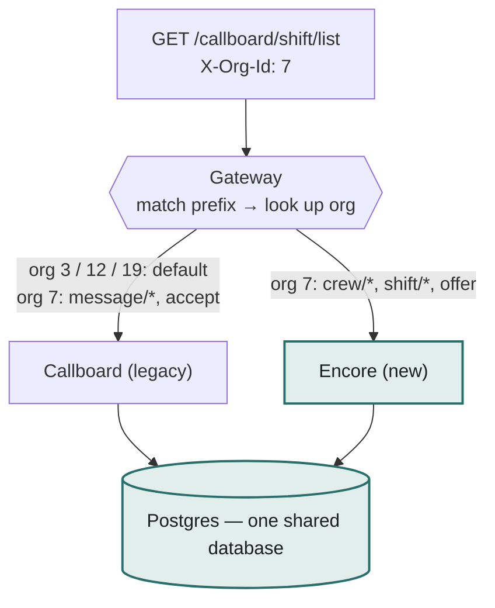

# Strangling Callboard

Two waves into pulling ShowCall's 15-year-old legacy backend apart from underneath its own
frontend, one seam at a time. This is the record for the team: where we started, the method we
followed, what actually shipped, and what we're deliberately leaving open.

The original assessment brief (setup, requirements, grading rubric) now lives in
[`ASSESSMENT.md`](ASSESSMENT.md). This file is the debrief.

| Wave | Scope | Status |
| --- | --- | --- |
| 1 | crew | ✅ Shipped |
| 2 | shifts, assignments, callboard_queue, background job | ✅ Shipped |
| 3 | messages, `assignment/accept`, digest logic | ⏭️ Next |

## Where we started

Callboard is a closed-source, 15-year-old backend we can't read the source of — only observe
from the outside. Nothing was built when this started: `encore/app/main.py` was a bare health
check, `routes.yaml` sent every request to Callboard, and there was no git history to speak of.
The mandate was a strangler migration — route traffic to a new FastAPI service (Encore) org by
org and path by path, with the legacy frontend never able to tell which backend answered it.

| | |
| --- | --- |
| **Gateway state** | 100% of traffic to `callboard`, routed by path prefix + org |
| **Schema** | 6 tables, inconsistent org columns — `tg_crew.org`, `shifts.org_id`, `messages.org` |
| **Open question #1** | `tg_crew.password` exists as a column — does it leak over the wire? **Resolved: no** — zero matches across all 13 probed endpoints; confirmed never selected/serialized (see Wave 1 below) |
| **Open question #2** | A `callboard_queue` table and an accelerated 5-min "nightly" job — unknown coupling, seeded to fire on the first tick |
| **Traffic sample** | 51 recorded requests across 4 orgs, 13 distinct endpoints — no recorded responses |
| **Grading signal** | Narrow, exact-fidelity work rewarded over broad, approximate work |

## What we followed

The same five-step cycle ran twice — once to scope and ship wave 1, once again for wave 2 —
because a wave plan for a black box is only as good as what you've actually watched it do.

1. **Probe.** Fire real requests at Callboard direct and watch what comes back — envelope
   shape, field types, error behavior, tenant isolation.
2. **Map seams.** Write down every coupling found, with evidence, in `SEAMS.md` — then a wave
   plan for what can move together.
3. **Build once.** One shared service layer per domain, called by both a modern `/v3` router
   and a byte-exact legacy wrapper.
4. **Prove parity.** Same request, same org, both backends, paired side by side — not "it
   looks right."
5. **Cut over.** Flip one org in `routes.yaml`, replay real traffic through the gateway,
   confirm nothing moved that shouldn't have.

> Watch write activity via Postgres's own counters first — no table scans, no locks, cost that
> doesn't grow with table size — then drill into specific rows by primary key. Never dump a
> table whole as a detection method: this seed is small, but the technique has to survive
> contact with a table that isn't.
>
> — the rule that shaped every probe, both waves

## How a request finds its backend

Every cutover comes down to one lookup: the gateway matches the longest path prefix it has a
rule for, then checks that rule's org map. No entry for the org means the rule's default wins.
Callboard and Encore read and write the *same* live Postgres instance — which is exactly what
makes a partial, org-by-org migration possible without a data-sync layer.

The routing decision is per (path prefix, org), re-read on every request — but both backends
land on the same database, so a table that hasn't moved yet still sees current data no matter
which service last wrote it.

## What we built

### Wave 1 — Crew ✅

owns: `tg_crew`

| Legacy wrapper | `/v3` | Modernized in `/v3` |
| --- | --- | --- |
| `/callboard/crew/list` | `GET /v3/crew` | real booleans, not `Y`/`N` |
| `/callboard/crew/show` | `GET /v3/crew/{id}` | parsed `prefs` object |
| `/callboard/crew/update` | `PATCH /v3/crew/{id}` | real 404s, not 200+fail; `password` never selected |

**Cut over:** org 7 · **Parity:** byte-diffed against Callboard direct, including the
malformed-id error passthrough

### Wave 2 — Shifts, assignments, the job ✅

owns: `shifts`, `assignments`, `callboard_queue` + the background job

| Legacy wrapper | `/v3` | Modernized in `/v3` |
| --- | --- | --- |
| `shift/list`, `show`, `create` | `GET`/`POST /v3/shifts` | ISO datetimes, not venue-local strings |
| `shift/cancel`, `roster_rows` | `POST .../{id}/cancel` | lowercase status words |
| `assignment/offer` | `POST .../{id}/assignments` | no `roster_rows` HTML clone; the job ported whole, not left behind |

**Cut over:** org 7 · **Parity:** byte-diffed live, including DB side effects — `CXL` message
bodies, the `staffing_status` literal

## What we found along the way

- **Cancelling a shift never reopens its slots.** Confirmed live: `shift/cancel` only sets
  `staffing_status` to a literal `'CXL'`. `open_slots` is left exactly where it was. Reproduced
  as-is in the wrapper, not silently fixed — see `TRADEOFFS.md`.
- **The digest job has two real bugs.** One unpersonalized body sent to every recipient, and an
  unconditional resend every tick instead of once per event. Left out of wave 2's port on
  purpose — it isn't idempotent, so running two copies at once would double the spam, not no-op.
- **Callboard's own job can't be switched off per org.** It's a black box with no config
  surface, so it keeps running org-wide even after a table migrates. Safe here specifically
  because stale-offer expiry and queue-drain are both guarded, idempotent operations — a double
  run is a no-op either way.
- **`message/confirm` secretly runs `accept`'s exact logic.** It resolves a message to an
  assignment and replays the identical accept path. That's the reason wave 3 has to own both
  endpoints together — splitting them would mean two independent "accept" implementations
  racing the same rows.

## What's still open

Wave 3 picks up `messages`, `message/{list,send,confirm}`, `assignment/accept`, and the job's
digest logic — the table and endpoints wave 2 deliberately left alone.

> **The one rule that can't bend:** once `assignment/accept` and `message/confirm` both exist
> as live endpoints, they flip to Encore **together, atomically, per org** — never staggered.
> An org where one is migrated and the other isn't is the one state this migration can't
> tolerate.

- **What does the queue drain actually do?** Pay is already computed synchronously by accept;
  the drain itself leaves no trace anywhere in this schema.
- **What's the real stale-offer threshold?** Only bounded to somewhere between 2.4 hours and
  30 days by real data. Defaulted to 24h and flagged — not pinned down by inserting rows into a
  database we're treating as a real shared store.
- **Is the digest bug intentional?** Reads like a bug, but there's no source to check —
  flagged as a wart to notice and not carry forward, not a certainty.

---

This file is a snapshot for the team. The working record — full probe evidence, the wave plan,
and every committed/cut/assumed/accepted decision — lives in [`SEAMS.md`](SEAMS.md),
[`SCOPING.md`](SCOPING.md), and [`TRADEOFFS.md`](TRADEOFFS.md).
